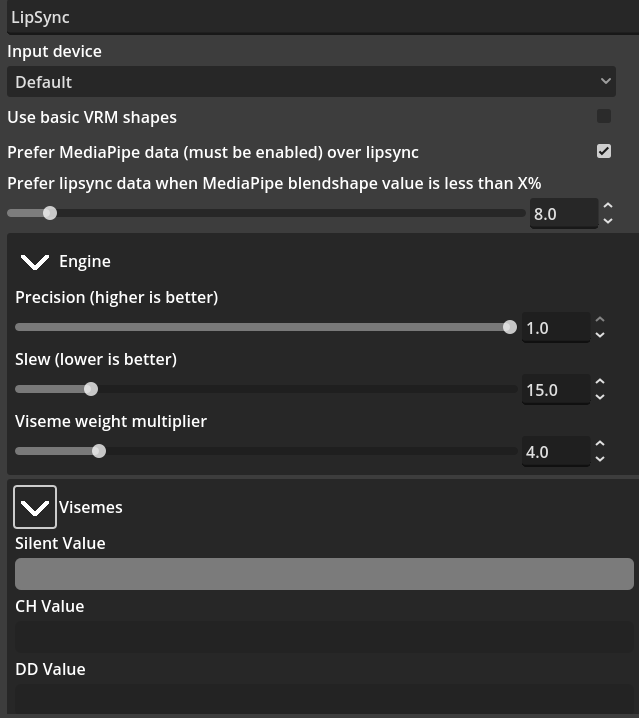
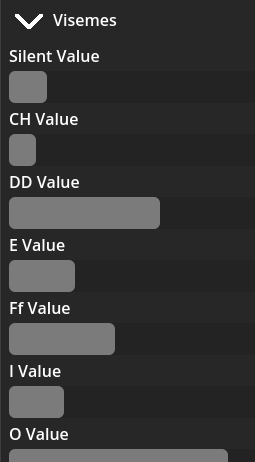

# LipSync Mod

The lip sync mod offers several options that enable you to enhance your experience with tracking in SnekStudio.

## Description

Real-time lip synchronization based on your microphone input, making sure your avatar's mouth movements match your speech.

LipSync does not rely on MediaPipe but it can enhance existing MediaPipe tracking for accurate mouth movement and maintains mouth movement even when the camera is blocked or obscured.

## Requirements

* Microphone (or other input device),
* AnimationApplier mod (LipSync must be ordered before this mod and after MediaPipeController),
* VRM avatar with Basic VRM, or MediaPipe blend shapes,

# Mod Settings

## Input Device
This is the input device that will be used as voice to synchronize mouth movements to.

This technically can be any input device, but is likely your microphone.

## Use basic VRM shapes
If your model does not have 50 blend shapes, this is the option to use. It is enabled by default.

## Preferred Data Sources

This section contains two settings:

* **Prefer MediaPipe data over LipSync**
* **Prefer LipSync data when MediaPipe blend shape value is below X%**

Enable the first setting if you have the **MediaPipeController** activated and wish to balance the lipsync data with input from the **MediaPipeController**.

In SnekStudio, blend shapes receive values that can later be edited by mods further down the list. While **LipSync** modifies blend shape values, it can prioritize MediaPipe data unless the values from the **MediaPipeController** fall below a certain threshold (X%).

Activating the first setting allows the second to define what "below expected" means, which defaults to 8%. Therefore, if your VRM jaw open value from the **MediaPipeController** is less than 8%, it will use the viseme data instead.

This functionality enables your VRM mouth to respond to microphone input while still being covered, allowing for natural movements even when obscured.

If you disable the first setting, only lipsync data will be utilized, disregarding any MediaPipe blend shape values.

## Engine Settings

This section contains three settings:

* **Precision**: Leave this at **1.0** unless you encounter performance issues.
* **Slew**: Defaults to **15ms**; this setting controls how values are blended over time.
* **Viseme Weight Multiplier**: If you find that your mouth movement is insufficient, consider increasing this value. The default is set to **4.0**.

## Visemes
If you want to see how your voice is converted into visemes, expand this tab, you will see progress bars for different visemes. Not all visemes are currently mapped, this is a work in progress.

