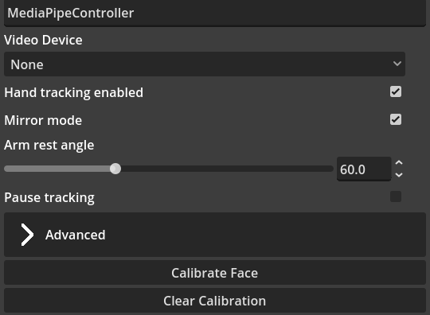
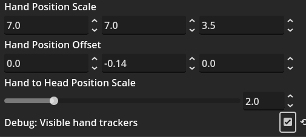

# MediaPipeController Mod

This mod is the main mod that you will use and has many different mods that rely on data from it. Technically, it can be replaced by other mods (if they were to be made), but likely not for now.

## Description
A MediaPipe-based camera-only tracking system.

If you're new to SnekStudio, or using it as the only application to run your VTuber model, you probably want to add this module first.

For importing tracking data from another application, see the VMCController.

Supports:
- Hand tracking
- 50 blend shapes
- Standard VRM blend shapes
- Various tuning parameters

## Requirements

- VRM 0.X model.

---

# Mod Settings

## Video Device
This is the video device that mediapipe blend shapes and tracking will happen with.

Generally, this is your web camera but any video input device can be used. You could even send camera data over IP, as long as it is an input video device it will work.

## Hand Tracking Enabled
This enables hand tracking, something you may not want. By default, it is enabled.

## Mirror Mode
Mirror mode mirrors the models actions to what you are doing in real life. If you raise your right hand and mirror mode is on, it will raise the models left hand. If the setting is off, the right hand would be raised.

## Arm Rest Angle
When there is no hand movement, the arms will sit on the model's side. If it isn't quite right, or correct you can modify this setting. 

This rotates the shoulder down so the arm is resting at the specific angle. It defaults to 60 degrees. The maximum is 180 degrees. You can test if the value is correct by looking at the model's arm position.

## Pause Tracking
Pause Tracking will stop all tracking - your model will freeze in pose. Sometimes helpful for posing.

## Calibrate Face Button

Generally you do not need to use this feature. If you are unsure, do not use the feature. You might find the **BlendShapeScalingAndOffset** mod better suited to smaller adjustments.

If your in real life face is not quite matching what your model is doing, you can calibrate the face of the model to have more average blendshape values based on what you are doing in real life.

When you press this button, for 200 milliseconds there will be a process that calculates the values of blendshapes as they are moving. Make sure you move your in real life face a bit during this time. At the end of the time each blendshape is calibrated based on the average of values over the time. 

## Clear Calibration Button

This simply removes the calibration for the face. It is a reset in case it is not quite correct.

## Advanced Mod Settings
These are further settings that enable you to tweak smoothing for the head and hand.

One of the features you might find useful is the "Debug: Visible hand trackers". 

Turn this on, and adjust the hand position scale and offset if it does not match what you are doing in real life. A good test is to touch your nose with your finger/hand and see how close it relates to the model's actions.

