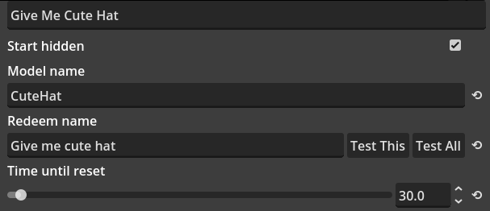

# ModelToggle Mod

This mod allows you to hide or show objects on your VRM.

## Description
A module that allows toggling pieces of the VTuber model on and off.

Used in conjunction with the TwitchIntegration module.

## Requirements

- VRM with objects that can be hidden or shown.
- (optional) TwitchIntegration mod for redeem toggles.

---

# Mod Settings

## Start Hidden
When the mod loads, it will check if the setting is start hidden. If it is, it will immediately set the object to hidden and not show it. This might be useful if you only want to have the mod shown when someone redeems or if you want to manually toggle the object without Twitch redeems.

By default, this is enabled.

## Model Name
A common mistake is thinking this is the name of your VRM model itself.

This is the name of the object you want to toggle. For example: "CuteHat" or similar.

## Redeem Name
The name of the redeem on your Twitch channel; this must match! If you update your Twitch redeem names, make sure to update the model toggle redeem names too.

You can test the redeem for this specific model toggle using the "Test This" button. Alternatively, the "Test All" button will send the redeem name to all mods in the application, which is helpful if you have multiple redeem names that are identical. This way, you can combine actions for the same redeem name across different mods.

## Time Until Reset
The time in seconds until the toggle is restored to the original setting. The maximum value of this is **1440 seconds**.
