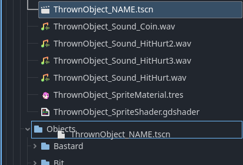
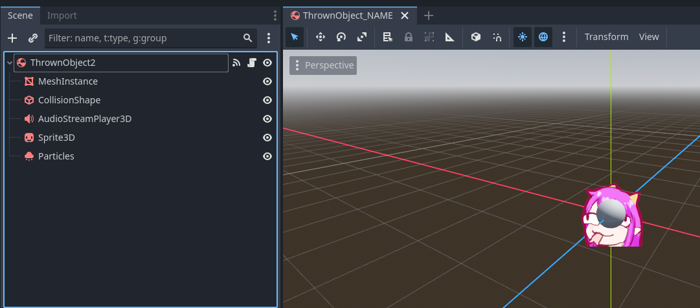
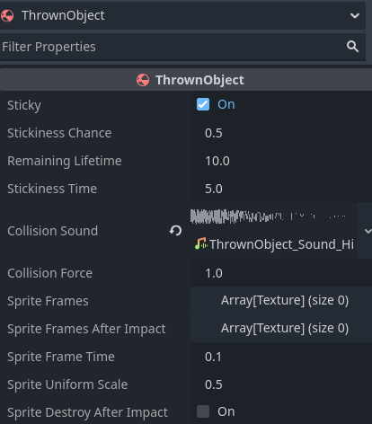
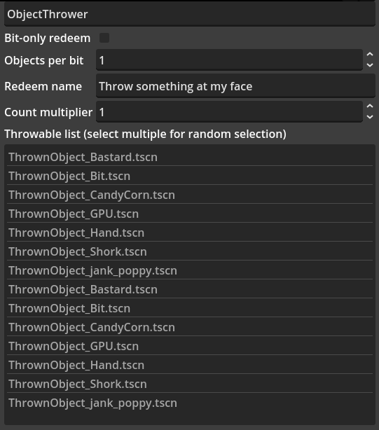
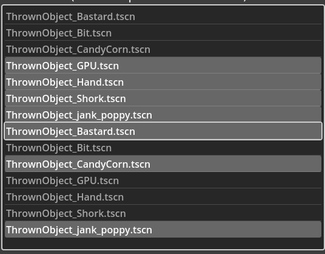

# ThrownObjects Mod
A fun mod that enables you to throw an array of existing objects, or custom objects, at your VRM model.

## Description
A module that allows objects to be thrown at the VTuber model.

Use in conjuction with the TwitchIntegration module to quickly set up thrown object redeems.

## Requirements
* TwitchIntegration - for bit and channel point redeems.

## Custom Objects

To add custom throwable objects you will need to have access to the Godot Editor to edit the project itself.

Example and existing objects are available in the [Mods -> ThrownObjects -> Objects folder](https://github.com/ExpiredPopsicle/SnekStudio/tree/main/Mods/ThrownObjects/Objects)

To start, duplicate the ObjectBase -> ThrownObject.tscn scene and rename it in the format of `ThrownObject_NAME` where name is the name of your object you will be adding.

Move the scene to the Objects folder.

Open the scene if you haven't already. It should look similar to this:

You can now edit the ThrownObject scene and change the sprites, particles and more. Feel free to look at other objects that already exist. 

The main settings are on the root node which are visible below in the jank_poppy scene:

Once you're happy, you don't have to do anything to add the object to the mod. It will appear in the object list on the mod settings.

---

# Mod Settings

## Bit-only Redeem
Enables only bit redeems. If you enable this, channel point redeems will not work. 

## Objects Per Bit
Specifies the number of objects thrown for each bit contributed during a cheer. It is used to calculate how many objects will be thrown based on the total bits received.

## Redeem Name
The name of the redeem on your Twitch channel; this must match! If you update your Twitch redeem names, make sure to update the Thrown Objects redeem names too.

## Count Multiplier
Count Multiplier is a numeric factor that amplifies the number of objects thrown based on the point/bit count. This can get confusing, read carefully.

When redeemed or bits are sent, it multiplies the total count of objects calculated from either channel point redemptions or bits contributed. When bits-only is not selected it will be the number of objects thrown.

Remember, the **Channel Event Tester** works well for this testing! Modules menu bar -> Channel Events Tester. Just fill in the bits and click "Test Chat", or "Test Redeem" for redeem.

### Channel Point Example
If Count Multiplier is set to 3, and there is a redeem that matches the name set in Redeem Name, then 3 objects will be thrown.

### Bits Example
If Count Multiplier is set to 2, and Objects Per Bit is set to 5, and 100 bits is sent then the number of objects thrown would be `(100 / 5) * 2` which is 40 objects thrown.

The formula for this is `(bits_count / objects_per_bit) * count_multiplier`

## Throwable List
You must select at least one item for this mod to work!

You can select multiple thrown objects from this list by using the following keyboard shortcuts:
* Hold Control Key - Select individually what objects you want to randomly select from
* Hold Shift Key - Select a range of objects quickly - similar to a file explorer application when selecting files.

