# Downloads

You can download **stable releases** or **nightly releases**. Both options are available for **Linux** and **Windows**.

## Latest Release (stable)

The latest release can be downloaded [here](https://github.com/ExpiredPopsicle/SnekStudio/releases/latest).

## Other Releases (nightly)

To access different versions, visit the [Releases Page](https://github.com/ExpiredPopsicle/SnekStudio/releases).

## Linux Users

A **Flatpak** is available for Linux users which is an asset on the releases.

If your platform is not available for download, you can open the project in the **Godot Editor**. More information on this process can be found in the README: [Getting Started](https://github.com/ExpiredPopsicle/SnekStudio/blob/main/README.md#getting-started-linux--windows).

---

# User Guide

The user guide is for first-time users or those wanting to learn more about what SnekStudio has to offer. It is more detailed than the Getting Started guide but covers similar content.

## Launching SnekStudio

Open the release of SnekStudio. You can double-click the file named "snekstudio" on both Linux and Windows. Wait for the splash screen to disappear, indicating that the application is ready to use.

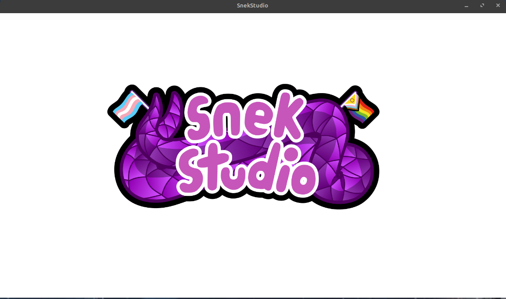

By default, some initial settings are applied, and an example model is loaded. This model is named "Samplesnek"; the VRM file can be found in the **SampleModels → VRM** folder.

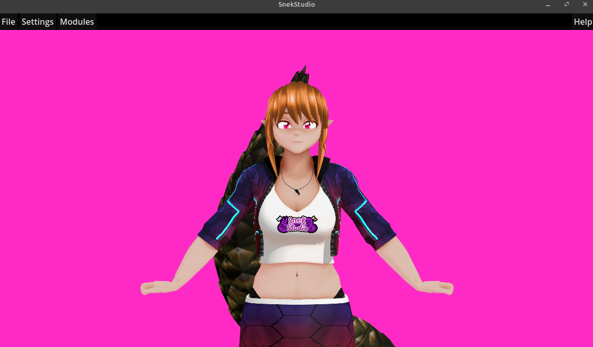

## Exploring the Main User Interface

Let's explore the main user interface. The image below contains numbers that represent the following headings.

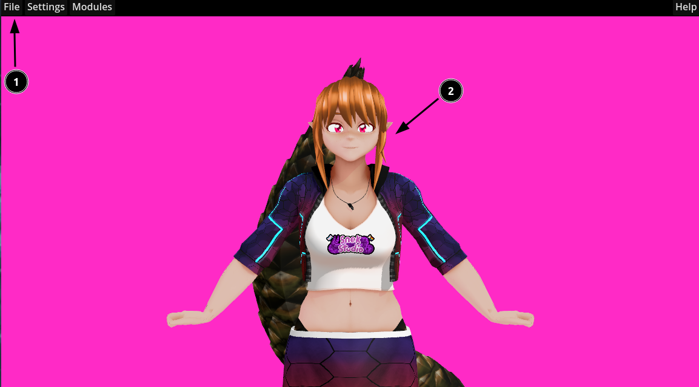

### 1. The Menu Bar

This is where all the settings are found. There are four items on the menu bar: **File**, **Settings**, **Modules**, and **Help**.

To load a new model (VRM), you can use the **File → Open VRM** item.

### 2. The Model Area

The model area is displayed through a camera that can be controlled by the mouse and keyboard:

* **Middle Mouse**: Rotate Camera
* **Shift + Middle Mouse**: Pan Camera
* **Mouse Wheel**: Zoom Camera

The model area also features a default background color and floor, displayed in the image below:

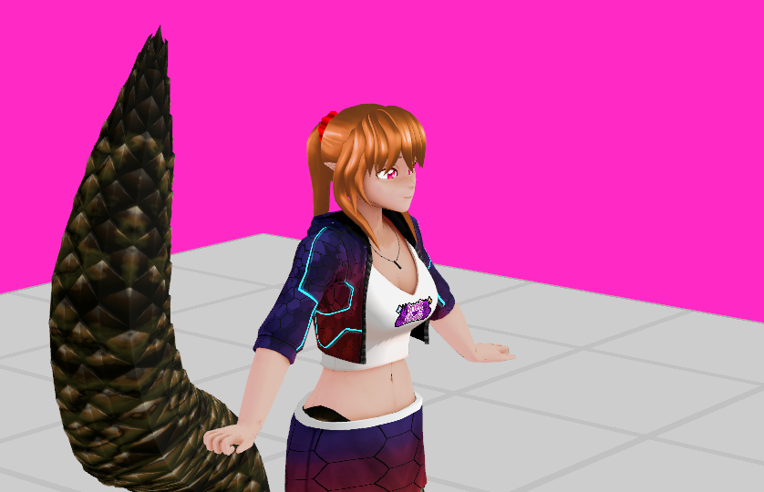

---

## Exploring the Menu Bar

The menu bar has several menus, outlined below:

### File Menu

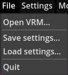

To change the model currently loaded, use **File → Open VRM**.

To backup and restore settings, use **File → Load/Save Settings**.

### Settings Menu

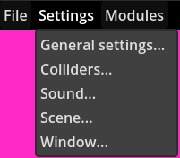

To change the background color, hide window decorations, control VSync mode, and enable a transparent background, use the **Settings → Window** menu.

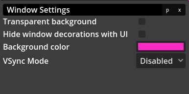

To change the FOV of the camera, use the **Settings → General Settings** menu.

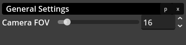

### Modules Menu

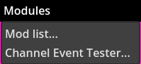

The main menu you will access is the modules area, which includes the mod list.

---

## Window Options

Windows opened through menu items and other interactions also have a few features:

* You can pop out a window from the main user interface by clicking the "p" in the top right corner.
* You can close the window by clicking the "x" in the top right corner.
* You can resize the windows as you would any other window.

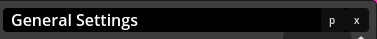

---

## Exploring the Mod List

The mod list includes available mods for SnekStudio. Check out the mod install guide (TODO) for instructions on installing mods into SnekStudio.

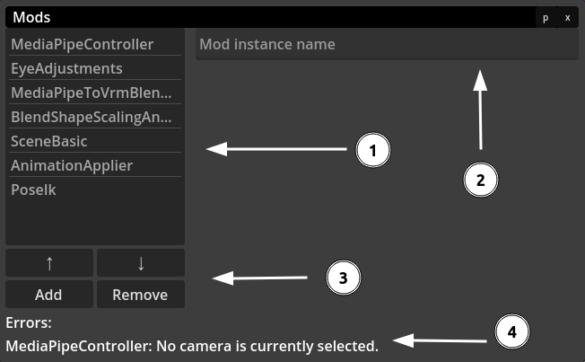

### 1. Mods Currently Loaded

The list shows active mods that are loaded into the scene. You can add more mods; the default setup does not include some useful ones!

Clicking on a mod in this list will display its settings, like so:

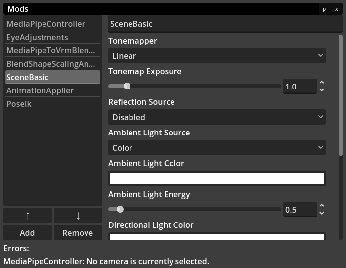

Any changes you make to these settings are instantly saved and applied; there are no save buttons!

### 2. Mod Instance Name

Each instance of a mod can have a different name. By default, a mod's instance name corresponds to the mod name.

### 3. Mod List Controls

You can add, remove, or move a mod up or down using these buttons. You can add more than one instance of a mod at a time. For example, you might have two or three **ModelToggle** mods for different toggles.

### 4. Any Active Errors

Any errors from within mods are shown here. Currently, there is an error indicating that no camera is selected in the **MediaPipeController** mod.

---

## Tracking in SnekStudio

You may have noticed that the model does not "move" or track by default, which is also indicated by the error regarding a camera not being selected.

Before we address this error, it's essential to understand how tracking functions in SnekStudio. 

Several mods are involved in the tracking process, and they must be ordered correctly in the mod list for proper execution:

1. **MediaPipeController**: Tracks hands and face based on camera data for 50 blend shapes.
2. **EyeAdjustments**: Applies small adjustments to the eyes as per your settings.
3. **MediaPipeToVrmBlendShapes (optional)**: Converts MediaPipe blend shapes to basic VRM blend shapes, which is often desired for most VRM 0.X models.
4. **BlendShapeScalingAndOffset**: Changes blend shape scaling, offset, and smoothing.
5. **LipSync (optional)**: Enables microphone tracking for lip and mouth movement. This mod should be placed before the animation applier.
6. **AnimationApplier**: Applies animations to the model.
7. **RotateTrackers (optional)**: Rotates trackers to compensate for slight camera angles. This must be positioned between mod 1 (MediaPipe) and mod 8 (PoseIK) in the list.
8. **PoseIK**: Positions the model based on tracker input.
9. **BlendShapeOverride (optional)**: Overrides blend shape values directly.

You may notice that some mods are missing from the initial setup; that’s perfectly fine! Not all mods are required for functionality, and optional mods can be beneficial depending on your specific setup.

### Other Tracking Mods

For those who are adventurous or interested in exploring alternative tracking styles, here are a few additional tracking mods:

* **VMCController**: Allows for receiving Virtual Motion Capture (VMC) data from applications like VSeeFace.
* **HOTAS**: Adds support for animating a model that controls a HOTAS-style controller.
* **GraphicsTablet**: A work-in-progress mod that converts graphics tablet motions into SnekStudio tracking.
* **VMCSender**: A work-in-progress mod that enables sending VMC-compatible data to other applications.

### Getting Tracking to Work

Let’s resolve that error!

To address the camera error, click on the **MediaPipeController** mod and change the **Video Device** to your webcam or video device:

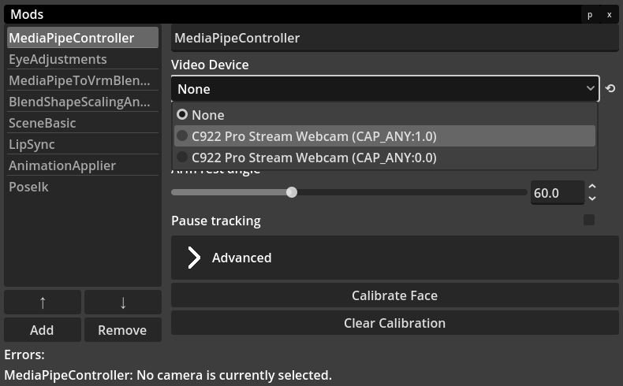

You may see more than one device with the same name. In the example, there are two **C922** cameras; only one will work. To find out which one, select each device and see if tracking is working on the model. Try other devices until it does.

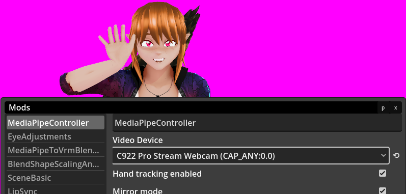

In the settings, you can also adjust whether hand tracking is enabled and modify other settings like head rotation smoothing, blending, and reset time. Feel free to play around with these options. More details on each can be found in the [**MediaPipeController**](Mods/MediaPipeController.md) mod docs.

---

## Changing Scene Details

Now you can move on to setting up the scene with the right lighting and directional light colors. These settings are controlled under the **SceneBasic** mod, as shown below.

You can disable the ground plane (floor) by scrolling to the bottom and unchecking the "Draw Ground Plane" option.

Finally, enable the transparent background in the **Settings** menu bar under the **Window** menu item.

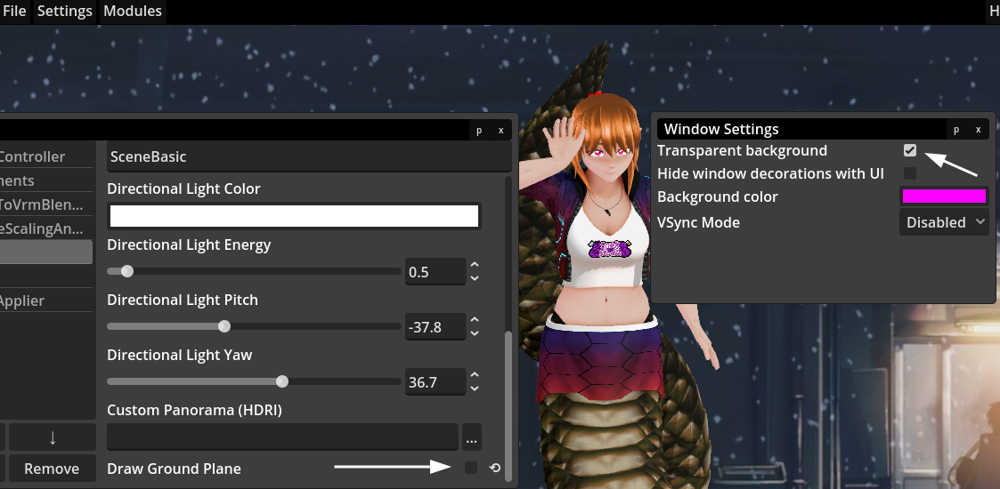

## Hiding User Interface

To hide all user interface dialogs, press the **Escape** key. You can restore these dialogs at any time by pressing the **Escape** key again.

---

## Broadcast Software Setup

Unlike other applications, SnekStudio does not support Spout2 or other methods for capturing the window.

Simply add a new window capture and select the window, making sure you have **transparency** enabled in SnekStudio.

Your final setup might look like this on Linux:

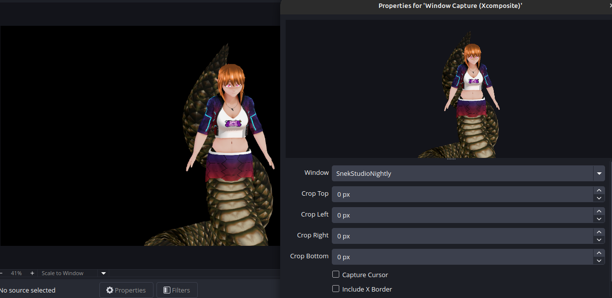

### Twitch Integration

If you wish to use mods that feature redeems (such as **HeadPats**, [**ThrownObjects**](Mods/ThrownObjects.md), [**ModelToggle**](Mods/ModelToggle.md)), you must add the **TwitchIntegration** mod.

Navigate to the mod list (**Modules → Mod List**) and add the **TwitchIntegration** mod via the add dialog:

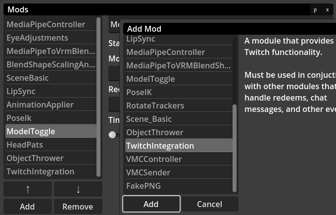

Immediately, your web browser will open and display a Twitch authorization page:

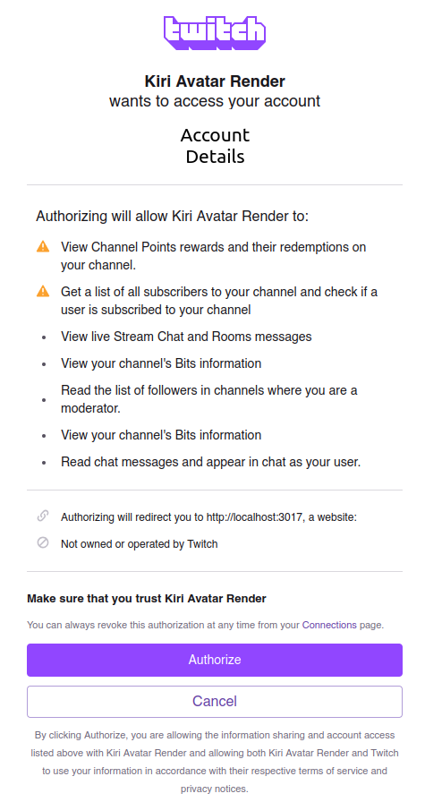

Read all permissions carefully that you are granting to SnekStudio, then click **Authorize** or **Cancel**.

If you click **Authorize**, you will be redirected back to a localhost website:

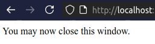

You can then close the tab and return to SnekStudio. The mods that rely on redeems will now function properly.

Feel free to test redeems using the **Modules → Channel Event Tester** tool.

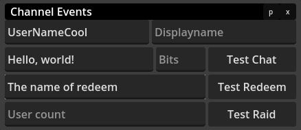

---

## Conclusion

This guide should provide you with a strong foundation for using SnekStudio effectively, allowing for intricate model interactions and settings adjustments. Don’t hesitate to explore the various features and mods available to enhance your experience!

For further assistance, check out [individual mod documentation](index.md) or join the [community](https://snekstudio.com/#community) through Discord or Matrix.