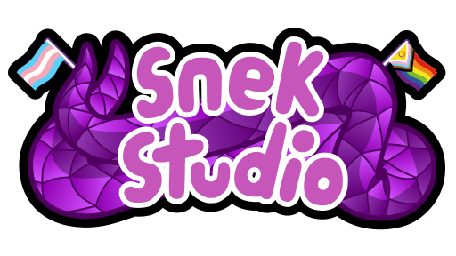
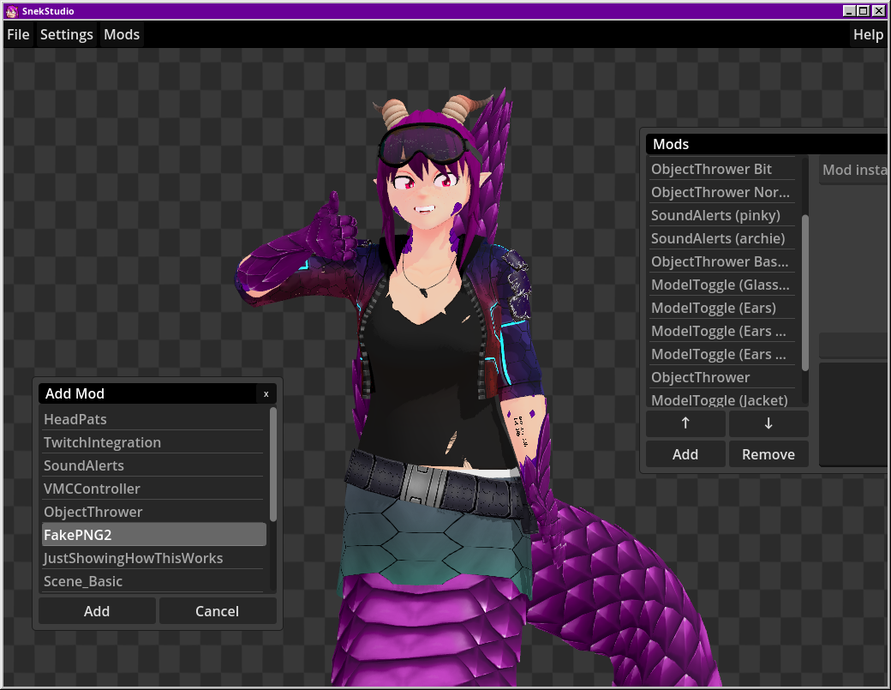

# SnekStudio Super ~~Secret~~ Public Alpha Edition



Hello! Welcome to the alpha version of SnekStudio. This is the software I've
been using in production for streams since around 2022. It's "organically
grown", so-to-speak. The code's a bit of a mess, but I've finally decided to
make it open-source and available to everyone.

Anyway, this is just my way of saying the code will do psychic damage to you if
you look too closely into my code crimes.

<3

## Download

Binary releases are available [on GitHub](https://github.com/ExpiredPopsicle/SnekStudio/releases) for Linux and Windows.

## Run from source

If you're on a platform for which there is no release yet (MacOS), want to tinker with SnekStudio, or write your own modules, here's how to go about that:

1. Clone the repository **recursively**.
    ```
    git clone --recursive https://github.com/ExpiredPopsicle/SnekStudio.git
    ```
    1. If you forget to clone recursively, run `git submodule init` and `git submodule update`.
    2. When pulling the newest changes from SnekStudio, use `git pull --recurse-submodules` to ensure submodules (like TwitchGD4) get updated too.

2. Open the project in Godot 4.4.

3. Set up Python Standalone + its dependencies by clicking the "Python Builds" tab in the bottom panel, and clicking both "Download" buttons for your platform. This can freeze the editor while downloading, so give it some time.

4. Run SnekStudio from the editor with the "Run Project" button in the top right. On first launch, this can also take some time to download the needed Python modules. (Visual feedback will be added later.)

5. (optionally) Load up your own model. Note that **only VRM 0.x models are currently supported**. VRM 1.x will have serious issues.

6. Configure "MediaPipeController" (`Esc` -> "Modules" -> "Mod list...") and select your video device. If there's similar entries, be sure to check the others if the first doesn't work.

SnekStudio is still in early development, so is lacking in documentation and might be not be as straight-forward to use as it could be. If you need help or want to help out, join the [community](https://snekstudio.com/#community).

## Project Goals

1. Make a solution for 3D VTuber face/model tracking.

2. Make it free for everyone to use.

3. Make a fully open-source.

4. Make it as cross-platform.
  - Supporting x86, AMD64, ARM, and other architectures.
  - Supporting Linux and Windows, with possible Mac and limited web (HTML5)
	support down the road.

5. Make it compatible with existing standards.
  - Support VRM.
  - Support VMC.

6. Make it as accessible to everyone as possible.
  - Minimal system hardware requirements.

7. Make it last as long as possible.
  - Do not tie ourselves to technologies at risk of becoming unsupported.
  - Make the code clean, modular, and easily maintainable.
  - Do not rely on native code with complex build environment requirements (eg
	other languages).

## Known Issues

So many. Please please please use the bug reporting tools on Github.
